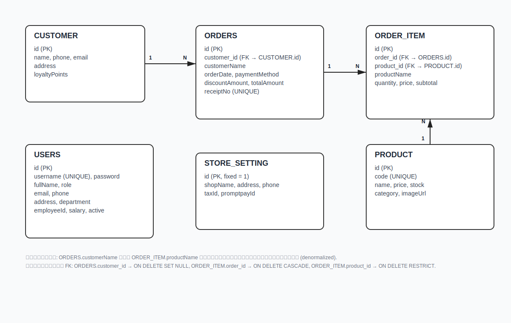

# 🐱 Cat Café POS (Spring Boot + MySQL)

ระบบขายหน้าร้าน (POS) สำหรับคาเฟ่ ให้พนักงานขายได้เร็ว จัดการเมนู/ลูกค้าได้ง่าย พร้อมรายงานสรุปยอดขายแบบกราฟสวยงาม ทั้งหมดรันบน Spring Boot ฝั่งเดียว (ฝั่งหน้าเว็บเสิร์ฟจาก `static/`).

เปิดใช้งานผ่านเบราว์เซอร์: `http://localhost:8080`

---

## ✨ ฟีเจอร์หลัก
- หน้าขาย (POS) เลือกเมนูใส่ตะกร้า ปรับจำนวน ล้างตะกร้า ชำระเงินแบบเงินสด/สแกนจ่าย
- จัดการเมนู: เพิ่ม/แก้ไข/ลบ, ราคาขาย, คงเหลือ, หมวดหมู่, รูปภาพ
- ข้อมูลลูกค้า: ค้นหา/เพิ่ม/แก้ไข/ลบ พร้อมแต้มสะสมและคูปองแลกเครื่องดื่มฟรี (100 แต้ม = 1 คูปอง)
- รายงานการขาย: กราฟ 7 วัน, รายเดือน, ออเดอร์ตามช่วงเวลา และเมนูขายดี
- ระบบล็อกอินพนักงาน (มีบัญชีทดสอบ)

> แต้มสะสม: โดยค่าเริ่มต้นระบบคำนวณ 1 แต้มต่อยอดซื้อประมาณทุก 10 บาท และสามารถแลก 100 แต้มเป็นคูปองได้ 1 ใบ (ดูรายละเอียดใน `LoyaltyService`/`CartService`).

---

## 🧩 สถาปัตยกรรมและส่วนประกอบ

โครงสร้างแพ็กเกจหลัก (ฝั่ง Backend):
- `controller/` กลุ่ม REST Controllers
  - `AuthController` จัดการล็อกอิน/เซสชัน
  - `CartController` คำนวณตะกร้า สรุปยอด ส่วนลด/แต้ม
  - `CustomerController` จัดการลูกค้า (CRUD)
  - `OrderController` ออเดอร์ + API รายงานช่วงวันที่
  - `PaymentController` ชำระเงิน/ยืนยันการรับชำระ (หากมี)
- `service/` กลุ่มบริการธุรกิจ
  - `OrderService` บันทึกออเดอร์ อัปเดตสต็อก สร้างเลขใบเสร็จ
  - `LoyaltyService` คำนวณ/เพิ่มแต้ม, ข้อมูลคูปอง
  - `CartService` สรุปตะกร้า คิดแต้มที่ได้รับ โบนัส/คูปอง
  - `PaymentService` ช่วยงานชำระเงิน
- `model/` เอนทิตี JPA เช่น `Product`, `Customer`, `Order`, `OrderItem`
- `repository/` Spring Data JPA Repositories

ฝั่ง Frontend (เสิร์ฟจาก Spring):
- `src/main/resources/static/index.html` — หน้าเว็บหลัก
- `static/js/index.js` — ฟังก์ชันฝั่งลูกค้า (POS, ค้นหา, รายงาน, โมดัลต่าง ๆ)
- `static/css/index.css` — ธีม/สไตล์ UI

ไลบรารีหลัก: Spring Boot, Spring Data JPA, MySQL Connector/J, Chart.js (กราฟฝั่งหน้าเว็บ)

---

## 🗺️ ER Diagram (Relational Model)

ภาพรวมความสัมพันธ์ฐานข้อมูลหลักของระบบ POS นี้ (ลูกค้า–ออเดอร์–รายการสินค้า–เมนู) ดังรูป:



หมายเหตุย่อ:
- Customer 1–N Orders, Order 1–N OrderItem, Product 1–N OrderItem
- เก็บชื่อซ้ำสำหรับใบเสร็จ: `orders.customerName`, `order_item.productName`
- แนะนำ FK: ลบ Order ควรลบ OrderItem ทั้งหมด, ลบ Product ควรถูกป้องกันเมื่อถูกอ้างถึงใน OrderItem

---

## 🛠️ การติดตั้งและรัน (Quick Start)

ข้อกำหนด
- Java 17+ (ทดสอบกับ JDK 21 ได้)
- Maven 3.8+ (หรือใช้ `./mvnw` ถ้ามี)
- MySQL 8.x

1) ตั้งค่า MySQL ใน `src/main/resources/application.properties`
```
spring.datasource.url=jdbc:mysql://localhost:3306/catcafe?createDatabaseIfNotExist=true&useSSL=false&allowPublicKeyRetrieval=true&serverTimezone=Asia/Bangkok
spring.datasource.username=<USERNAME ของคุณ>
spring.datasource.password=<PASSWORD ของคุณ>
spring.jpa.hibernate.ddl-auto=update   # สำหรับ dev
```
หมายเหตุ: เปลี่ยน `username/password` ให้ตรงกับเครื่องของคุณ และสามารถเปลี่ยนชื่อ DB ได้ตามต้องการ

2) รันด้วย Maven (แนะนำสำหรับ dev)
```bash
mvn spring-boot:run
# หรือ
./mvnw spring-boot:run
```

3) เปิดเบราว์เซอร์ที่ `http://localhost:8080`

4) (ทางเลือก) สร้างไฟล์ jar
```bash
mvn clean package
java -jar target/<ชื่อไฟล์>.jar
```

---

## 🔐 บัญชีทดสอบ (Demo)
หน้าเข้าสู่ระบบมีปุ่มกรอกบัญชีทดสอบอัตโนมัติ หรือใช้คู่มือด้านล่างนี้ได้เลย:
- ผู้ดูแลระบบ: `admin / admin123`
- ผู้จัดการ: `manager / manager123`
- พนักงานขาย: `cashier / cashier123`

---

## 🧭 วิธีใช้งานโดยย่อ (Walkthrough)
1) เข้าสู่ระบบ → เข้าหน้า POS
2) เลือกเมนูจากกริด → ใส่ตะกร้า ปรับจำนวนได้
3) กดชำระเงิน → เลือกช่องทาง (เงินสด/สแกนจ่าย) → ยืนยัน
4) ไปที่ “จัดการเมนู” เพื่อเพิ่มเมนูใหม่/แก้ไขราคา/คงเหลือ/หมวดหมู่/รูปภาพ
5) ไปที่ “ข้อมูลลูกค้า” → เพิ่มลูกค้า/ค้นหาตามชื่อ/เบอร์ และดูแต้มสะสม
6) ไปที่ “รายงานขาย” → ดูยอดรวมวันนี้/กราฟ 7 วัน/รายเดือน/เมนูขายดี/สรุปรายวัน

ทิปส์:
- ช่องค้นหาด้านบนใช้กรองได้ตามหน้าที่เปิดอยู่ (POS/เมนู/ลูกค้า)
- แต้มสะสมจะเพิ่มเมื่อชำระเงินสำเร็จ และสามารถใช้คูปองเพื่อรับรายการฟรีตามกติกาแต้ม

---

## 📡 API คร่าว ๆ (ฝั่งหน้าเว็บเรียกใช้)
- `GET /api/products` — รายการเมนู
- `POST /api/products` — เพิ่มเมนู, `PUT /api/products/{id}`, `DELETE ...`
- `GET /api/customers` — รายชื่อลูกค้า (CRUD คล้ายกัน)
- `GET /api/orders/report?start=YYYY-MM-DD&end=YYYY-MM-DD` — ดึงออเดอร์ช่วงวันที่ (ใช้วาดกราฟ)
- `POST /api/payment` / `POST /api/cart` — ใช้งานในขั้นตอนคำนวณ/ชำระเงิน (ขึ้นกับบริการที่มี)
- `GET /api/settings` (และ `PUT`) — ข้อมูลหน้าร้าน/หัวบิล

หมายเหตุ: โค้ดฝั่ง JS อาจเพิ่มพารามิเตอร์หรือรูปแบบ payload เฉพาะ ควรดูไฟล์ `static/js/index.js` ประกอบ

---

## 🧱 โมเดลข้อมูลหลัก
- `Product` (รหัส, ชื่อ, ราคา, คงเหลือ, หมวดหมู่, รูปภาพ)
- `Customer` (ชื่อ, เบอร์, อีเมล, ที่อยู่, แต้มสะสม)
- `Order`/`OrderItem` (ออเดอร์/รายการสินค้า, ยอดรวม, ส่วนลด, วันที่ออกบิล)

---

## 🧩 หมายเหตุการตั้งค่า/โปรดักชัน
- สำหรับโปรดักชัน แนะนำเปลี่ยน `spring.jpa.hibernate.ddl-auto=none` และใช้สคริปต์ไมเกรชัน
- ตั้งค่า `server.port` (ดีฟอลต์ 8080) และ connection pool ให้เหมาะกับสภาพแวดล้อม
- ซ่อน/ไม่คอมมิตต์รหัสผ่าน DB (ใช้ Environment Variables/Config Server)

---

## 🙌 เครดิต & ไลเซนส์
โค้ดนี้จัดทำเพื่อการศึกษาและเดโมระบบ POS ขนาดเล็ก สามารถนำไปต่อยอดใช้งานจริงได้ตามความเหมาะสม
